# Test Results

## Test results in general
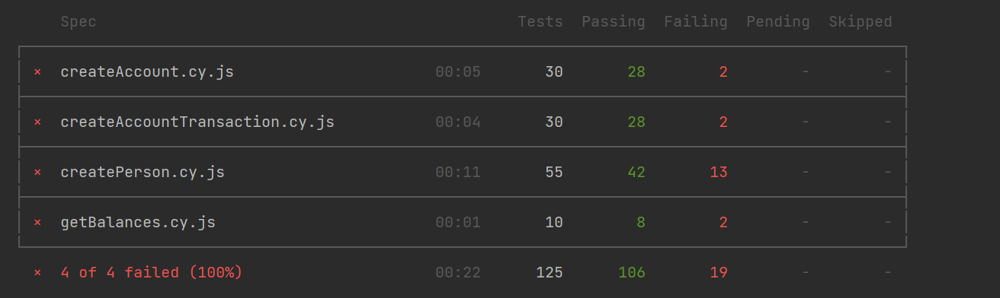

## "Create person" endpoint test results
### In general:
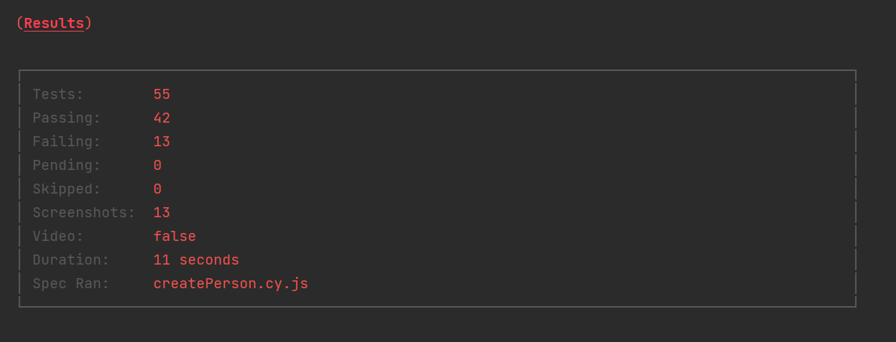
### In details:
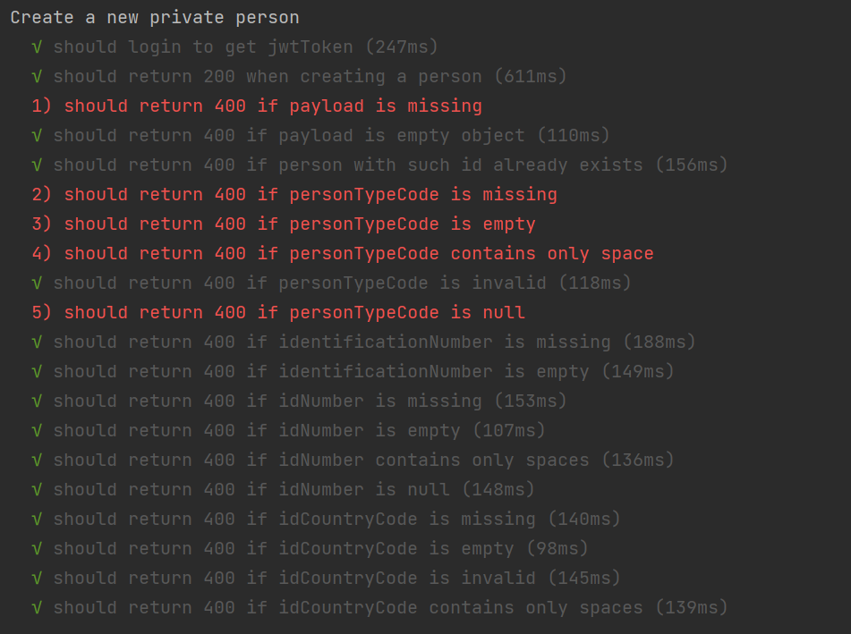
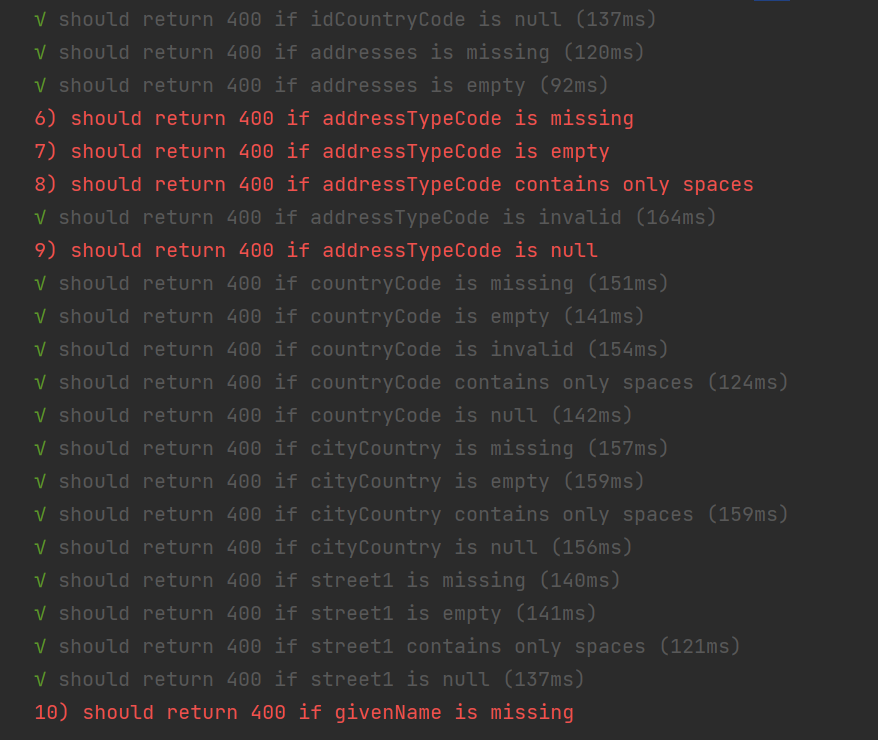
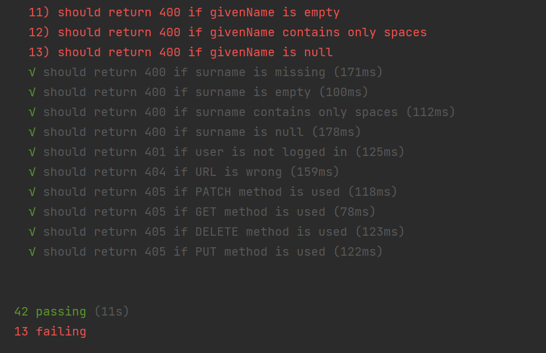

### Explanation to the failed tests:
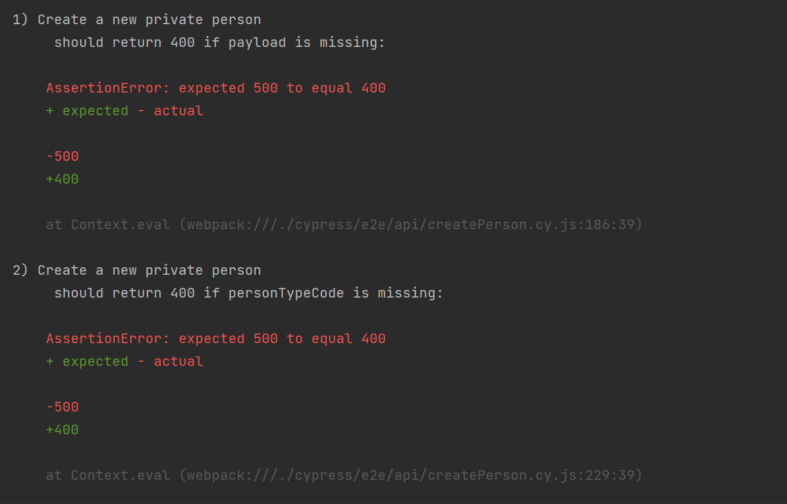
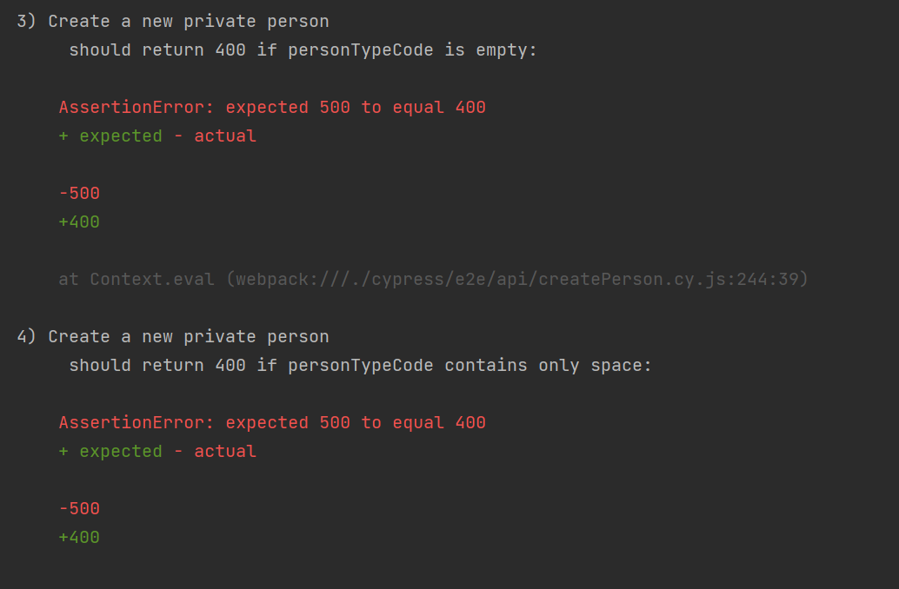
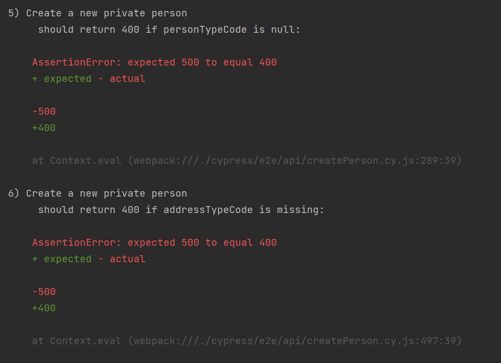
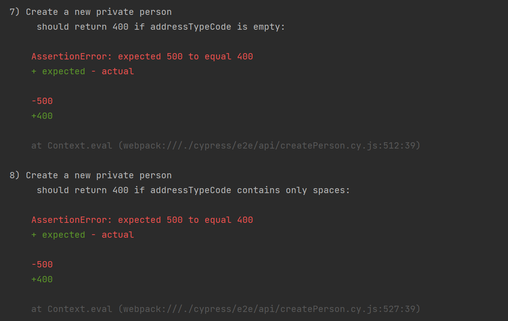
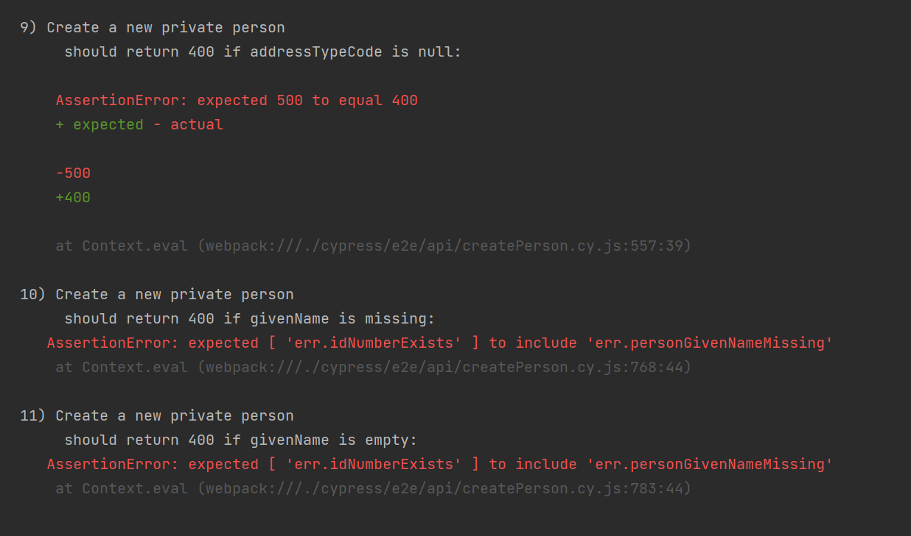
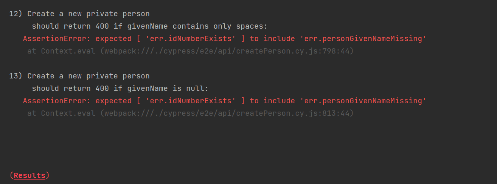

#### **Error 1**
**Error:** status code 500 is return when the payload is missing, while should have been 400 status code

If payload is missing the program should return status code 400 because the valid payload was not provided from the 
client-side, not from the server-side. Which means, that the client-side error happened and client-side errors should 
are 4xx status codes.

#### **Errors 2-9**
**Error:** status code 500 is return when personTypeCode or addressTypeCode is missing/empty/null/spaces only, while should have been 400 status code

If a required field is missing or empty/null/contains only spaces the program should return 400 status code
because the valid payload was not provided from the client-side, not from the server-side. Which means, that the client-side error happened and client-side errors should
are 4xx status codes.

#### **Errors 10-13**
**Error:** required field givenName do not have validation if the field is present in the payload or not

"givenName" is a required field (at least from the given payload example I consider it to be required field),
if the required field is not provided in the payload, the program should return corresponding error message

## "Create account" endpoint test results
### In general:

### In details:

### Explanation to the failed tests:

#### **Error 1**
**Error:** account cannot be created when only mandatory fields are filled in

According to endpoint documentation required fields are:
* accountTypeCode
* personName
* residencyCountryCode
* currencyCode

customerGroupCode is not a mandatory field, so the system should not return a validation error

#### **Error 2**
// TODO
