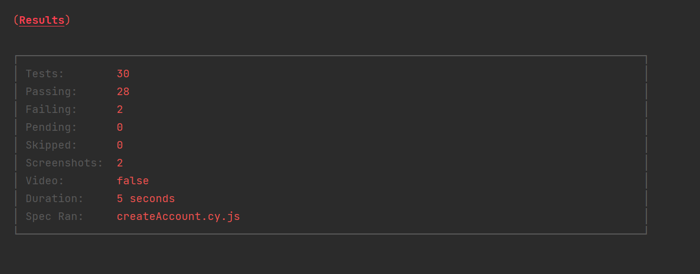
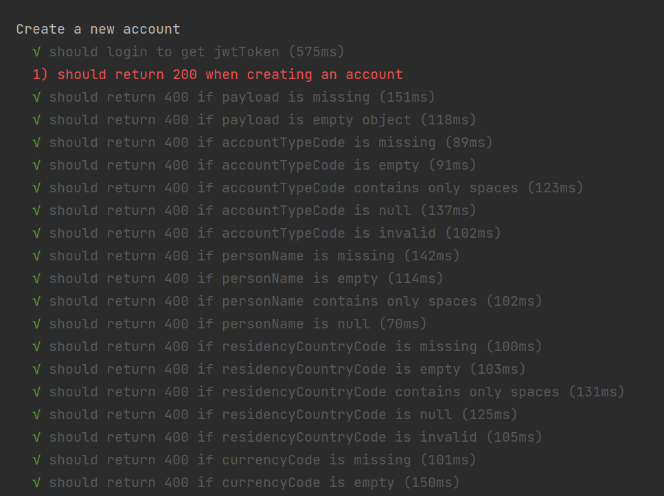
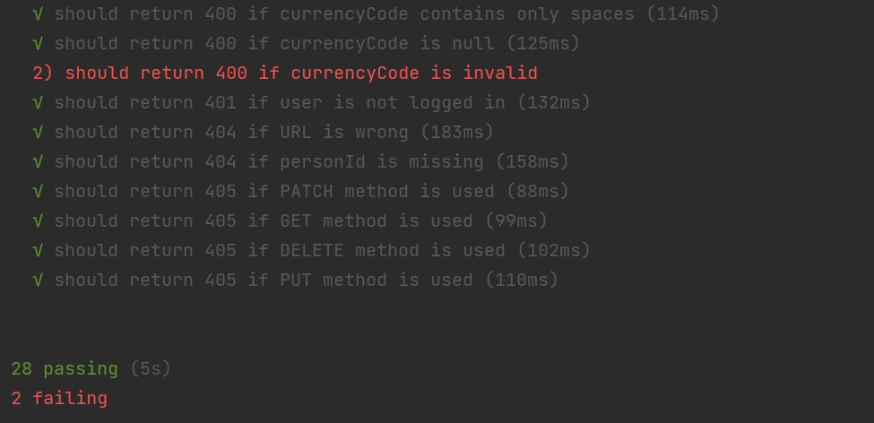
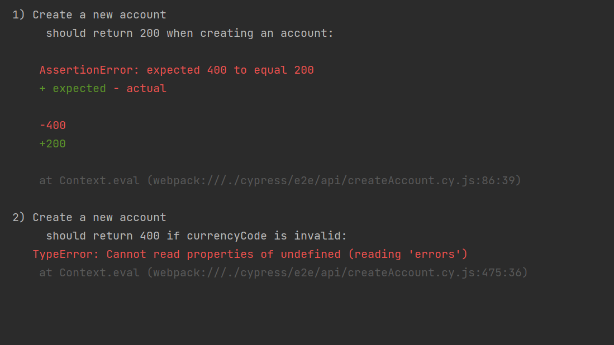
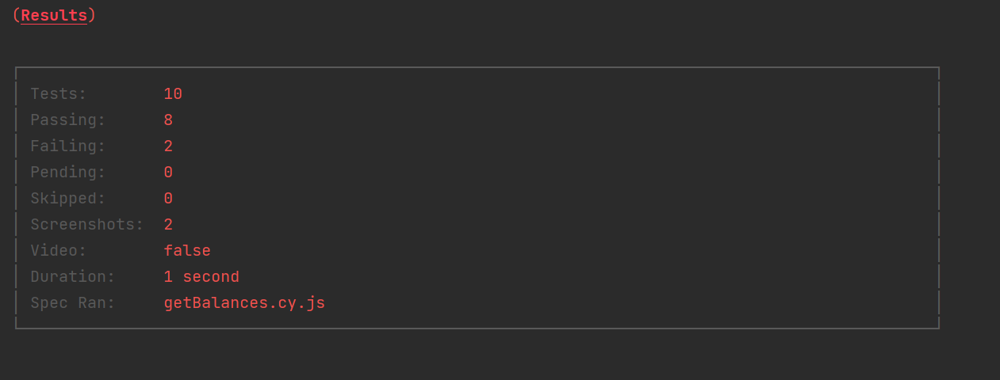
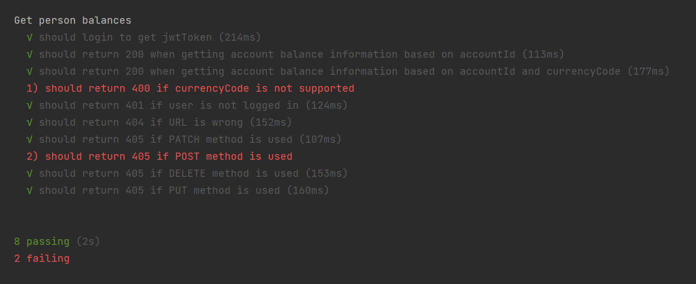
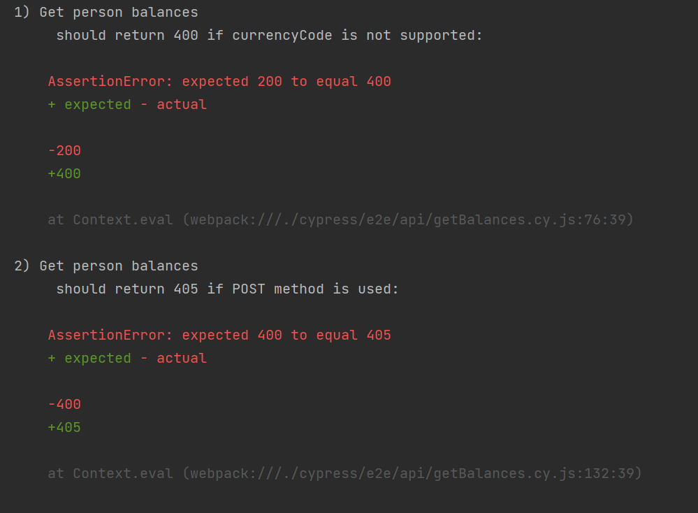
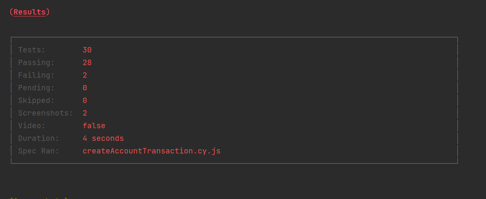
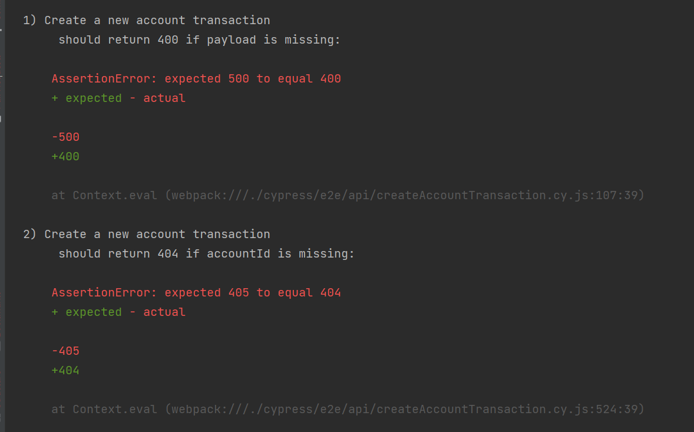

# Test Results

## Test results in general

## "Create person" endpoint test results
### In general:

### In details:

### Explanation to the failed tests:

#### **Error 1**
**Error:** status code 500 is returned when the payload is missing, while should have been 400 status code

If payload is missing the program should return status code 400 because the valid payload was not provided from the 
client-side, not from the server-side. Which means, that the client-side error happened and client-side errors should 
are 4xx status codes.

#### **Errors 2-9**
**Error:** status code 500 is returned when personTypeCode or addressTypeCode is missing/empty/null/spaces only, while should have been 400 status code

If a required field is missing or empty/null/contains only spaces the program should return 400 status code
because the valid payload was not provided from the client-side, not from the server-side. Which means, that the client-side error happened and client-side errors should
are 4xx status codes.

#### **Errors 10-13**
**Error:** required field givenName do not have validation if the field is present in the payload or not

"givenName" is a required field (at least from the given payload example I consider it to be required field),
if the required field is not provided in the payload, the program should return corresponding error message

## "Create account" endpoint test results
### In general:

### In details:

### Explanation to the failed tests:

#### **Error 1**
**Error:** account cannot be created when only mandatory fields are filled in

According to endpoint documentation required fields are:
* accountTypeCode
* personName
* residencyCountryCode
* currencyCode

customerGroupCode is not a mandatory field, so the system should not return a validation error

#### **Error 2**
**Error:** when sending request with currencyCode, which is not supported, when status code 400 but the validation error
for currencyCode invalidity is not present

The system has a list of supported currency codes and should not allow a client to send non-existing currency. It
might be and expected behavior due to system's design.

## "Get balances" endpoint test results
### In general:

### In details:

### Explanation to the failed tests:

#### **Error 1**
**Error:** when customer request for balance with currencyCode, which is not supported, when status code 200 is returned 
instead of status code 400

The system has a list of supported currency codes and should not allow a client to request for non-existing currency. It 
might be and expected behavior due to system's design.

#### **Error 2**
**Error:** when POST method is used instead of GET the status code 400 is returned instead of 405 status code

Using not allowed method should end up in 405 status code.

## "Create transactions" endpoint test results
### In general:

### In details:

### Explanation to the failed tests:

#### **Error 1**
**Error:** status code 500 is returned when the payload is missing, while should have been 400 status code

If payload is missing the program should return status code 400 because the valid payload was not provided from the
client-side, not from the server-side. Which means, that the client-side error happened and client-side errors should
are 4xx status codes.
#### **Error 2**
**Error:** status code 405 is returned when accountId is not added to the request URL instead of 404 status code

If URL does not contain accountId it makes the request URL wrong. There is no matching requests in the Swagger, which 
could have potentially return 405 status code then turning to given URL, so the status code returned should be 404 due 
to invalid request URL
