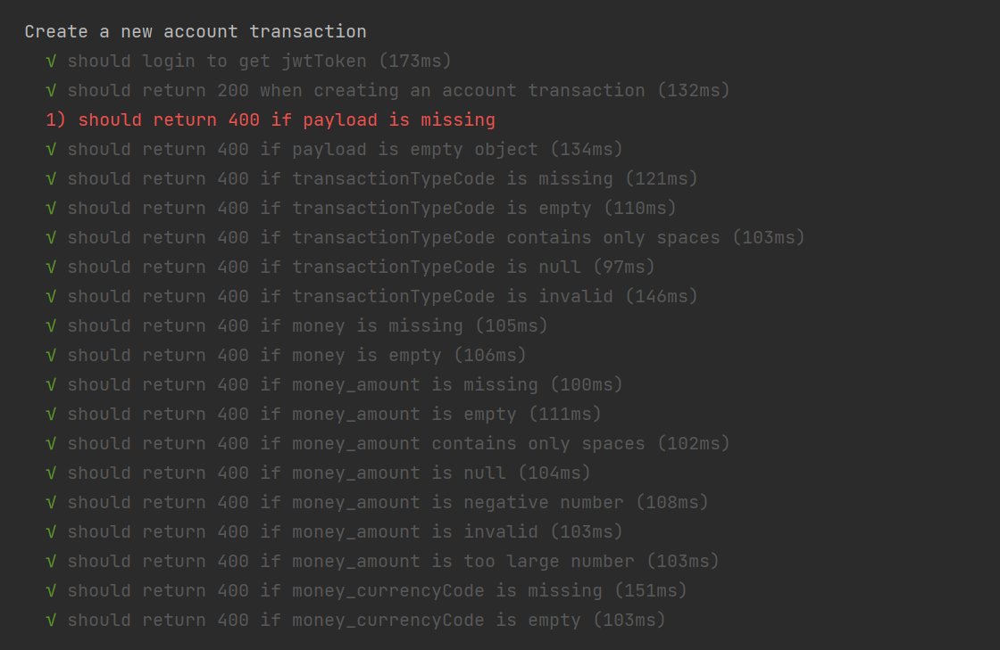
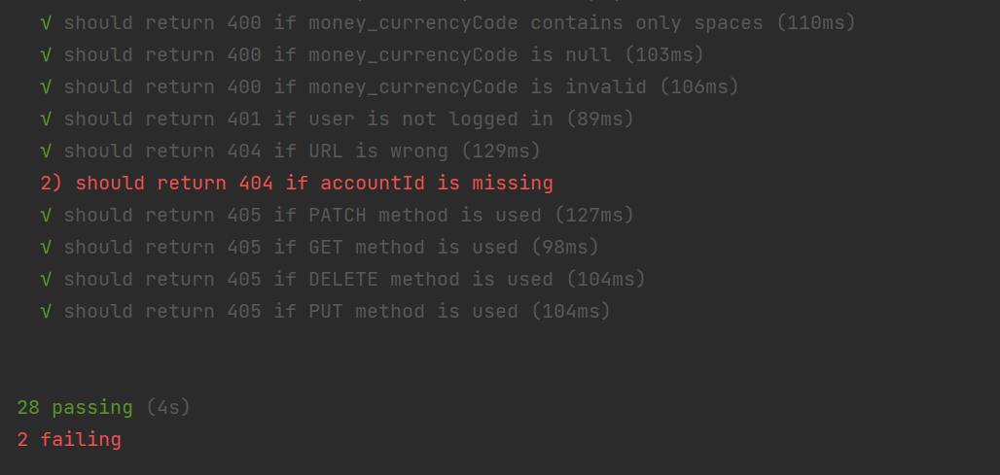

# Test Results

## Test results in general

## "Create person" endpoint test results
### In general:

### In details:

### Explanation to the failed tests:

Error 1: If payload is missing the program should return status code 400 because the valid payload was not provided from the 
client side, not from the server side
Errors 2-9: If a required field is missing or empty/null/contains only spaces the program should return 400 status code
because the valid payload was not provided from the client side, not from the server side
Errors 10-13: "givenName" is a required field (at least from the given payload example I consider it to be required field),
if the required field is not provided in the payload, the program should return corresponding error message

